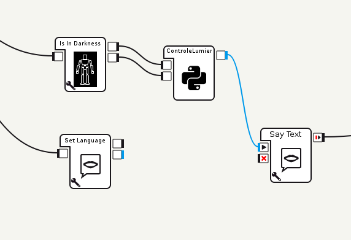

************************
Page d'autodocumentation
************************

Documentation sur la partie Domotique

.. warning::
   Attention les programmes réalisés ne marchent que sur leur support respectif

raspberryLumiere.py
===================

Documentation sur le programme sur la Raspberry

.. warning::
   Marche que sur une Rasberry B, à vérifier si vous utiliser une Rapsberry PI différente

.. automodule:: raspberryLumiere
    :members:

NAODomoLumiere.py
=================

.. note::
   Marche sur NAO V1 et V2

Documentation sur le programme dans NAO

   Image du programme sous Chorégraphe

.. automodule:: NAODomoLumiere
    :members:
